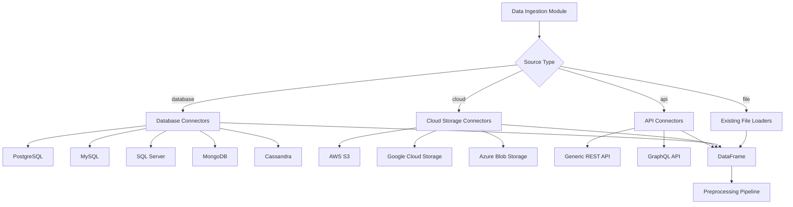

# Advanced Data Connectivity Feature Specification

## Overview

This document outlines the technical specification for Feature 2: Advanced Data Connectivity, which extends Greta's data ingestion capabilities beyond file-based sources to include databases, cloud storage, and API endpoints.

## Architecture Overview



### Modular Connector Architecture

The connector system follows a modular design with a base abstract class and specific implementations for different data sources.

#### Base Connector Class

```python
from abc import ABC, abstractmethod
from typing import Dict, Any, Optional, Union
import pandas as pd
import dask.dataframe as dd

DataFrame = Union[pd.DataFrame, dd.DataFrame]

class BaseConnector(ABC):
    """Abstract base class for all data connectors."""

    def __init__(self, config: Dict[str, Any]):
        self.config = config
        self.connection = None

    @abstractmethod
    def connect(self) -> bool:
        """Establish connection to data source."""
        pass

    @abstractmethod
    def disconnect(self):
        """Close connection to data source."""
        pass

    @abstractmethod
    def validate_connection(self) -> bool:
        """Validate that connection is active and functional."""
        pass

    @abstractmethod
    def load_data(self, query: Optional[str] = None, **kwargs) -> DataFrame:
        """Load data from source and return as DataFrame."""
        pass

    @abstractmethod
    def get_schema(self) -> Dict[str, Any]:
        """Get schema information for the data source."""
        pass

    def __enter__(self):
        self.connect()
        return self

    def __exit__(self, exc_type, exc_val, exc_tb):
        self.disconnect()
```

#### Specific Connector Implementations

##### Database Connectors

**PostgreSQLConnector**
- Uses `psycopg2` for connection
- Supports custom SQL queries
- Handles connection pooling

**MySQLConnector**
- Uses `pymysql` or `mysql-connector-python`
- Similar interface to PostgreSQL

**SQLServerConnector**
- Uses `pyodbc` or `pymssql`
- Windows Authentication support

**MongoDBConnector**
- Uses `pymongo`
- Supports MongoDB queries
- Handles document flattening

**CassandraConnector**
- Uses `cassandra-driver`
- Supports CQL queries

##### Cloud Storage Connectors

**S3Connector**
- Uses `boto3`
- Supports CSV, JSON, Parquet files
- Handles S3-specific authentication

**GCSConnector**
- Uses `google-cloud-storage`
- Similar interface to S3

**AzureBlobConnector**
- Uses `azure-storage-blob`
- Supports blob storage operations

##### API Connectors

**GenericAPIConnector**
- Supports REST and GraphQL endpoints
- Configurable authentication (Bearer, Basic, API Key)
- Handles pagination automatically
- Supports JSON and CSV response formats

### Configuration Schema

The configuration schema extends the existing `DataConfig` to support multiple source types:

```python
from pydantic import BaseModel, Field
from typing import Dict, Any, Optional

class DatabaseConnection(BaseModel):
    host: str
    port: Optional[int] = None
    database: str
    username: Optional[str] = None
    password: Optional[str] = None
    ssl_mode: Optional[str] = "require"
    connection_timeout: Optional[int] = 30

class CloudConnection(BaseModel):
    bucket: str
    region: Optional[str] = None
    access_key: Optional[str] = None
    secret_key: Optional[str] = None
    endpoint_url: Optional[str] = None

class APIConnection(BaseModel):
    base_url: str
    endpoint: str
    method: str = "GET"
    headers: Dict[str, str] = Field(default_factory=dict)
    params: Dict[str, Any] = Field(default_factory=dict)
    auth_type: Optional[str] = None  # bearer, basic, api_key
    auth_token: Optional[str] = None
    pagination: Optional[Dict[str, Any]] = None

class DataSourceConfig(BaseModel):
    type: str = Field(..., description="Data source type: file, postgres, mysql, mongodb, s3, api, etc.")
    # File-based (existing)
    source: Optional[str] = Field(None, description="File path for file-based sources")
    file_type: Optional[str] = Field(None, description="csv, excel for file sources")

    # Database connections
    connection: Optional[DatabaseConnection] = None

    # Cloud connections
    cloud_config: Optional[CloudConnection] = None

    # API connections
    api_config: Optional[APIConnection] = None

    # Common options
    query: Optional[str] = Field(None, description="SQL query, MongoDB query, or API parameters")
    target_column: Optional[str] = Field(None, description="Name of target column")
    chunk_size: Optional[int] = Field(None, description="Chunk size for streaming")
    backend: str = Field("auto", description="pandas, dask, spark")
```

### Integration with Existing Ingestion Module

The existing `load_csv` and `load_excel` functions remain unchanged for backward compatibility. New functions are added:

```python
def load_from_connector(connector_type: str, config: Dict[str, Any], **kwargs) -> DataFrame:
    """Load data using specified connector type."""
    connector_class = get_connector_class(connector_type)
    connector = connector_class(config)
    with connector:
        return connector.load_data(**kwargs)

def load_data(source_config: DataSourceConfig, **kwargs) -> DataFrame:
    """Unified data loading function that dispatches to appropriate loader."""
    if source_config.type in ['csv', 'excel']:
        # Use existing file loaders
        return load_csv(source_config.source, **kwargs) if source_config.type == 'csv' else load_excel(source_config.source, **kwargs)
    else:
        # Use connector system
        return load_from_connector(source_config.type, source_config.dict(), **kwargs)
```

### Error Handling and Connection Validation

All connectors implement comprehensive error handling:

```python
class ConnectionError(Exception):
    """Base exception for connection failures."""
    pass

class AuthenticationError(ConnectionError):
    """Raised when authentication fails."""
    pass

class QueryError(Exception):
    """Raised when data query fails."""
    pass

class ValidationError(Exception):
    """Raised when data validation fails."""
    pass
```

Connection validation includes:
- Testing connectivity
- Verifying credentials
- Checking data accessibility
- Schema validation

### Security Considerations

#### Credential Management

1. **Environment Variables**: Sensitive credentials stored in environment variables
2. **Configuration Files**: Encrypted credential storage with key management
3. **AWS/GCP/Azure IAM**: Use cloud provider IAM roles when possible
4. **Vault Integration**: Support for HashiCorp Vault or similar secret management

#### Best Practices

- No hardcoded credentials in code
- SSL/TLS encryption for all connections
- Connection timeouts to prevent hanging
- Credential rotation support
- Audit logging of access

### Streaming Data Ingestion

For large datasets, connectors support streaming ingestion:

```python
def load_data_streaming(self, query: str, chunk_size: int = 1000) -> Iterator[DataFrame]:
    """Load data in chunks for memory efficiency."""
    # Implementation varies by connector
    pass
```

Streaming support includes:
- Chunked reading from databases
- Paginated API responses
- Cloud storage object streaming
- Automatic concatenation into final DataFrame

### Dependencies

New dependencies to add to `pyproject.toml`:

```toml
# Database connectors
psycopg2-binary>=2.9.0
pymysql>=1.0.0
pyodbc>=4.0.0
pymongo>=4.0.0
cassandra-driver>=3.25.0

# Cloud connectors
boto3>=1.26.0
google-cloud-storage>=2.7.0
azure-storage-blob>=12.14.0
azure-identity>=1.12.0

# API and utilities
requests>=2.28.0
httpx>=0.24.0  # For async API calls
gql>=3.4.0  # GraphQL support

# Security
cryptography>=39.0.0
python-dotenv>=1.0.0
```

### CLI Integration

Extend the CLI configuration to support new data source types:

```yaml
data:
  type: postgres
  connection:
    host: localhost
    port: 5432
    database: mydb
    username: ${POSTGRES_USER}
    password: ${POSTGRES_PASSWORD}
  query: "SELECT * FROM my_table WHERE created_at > '2023-01-01'"
  target_column: target
```

CLI commands remain the same (`greta run --config config.yml`), with automatic dispatch based on `data.type`.

### Extensibility

The architecture supports adding new connectors by:

1. Creating new connector classes inheriting from `BaseConnector`
2. Adding connector type to registry
3. Updating configuration schema if needed
4. Adding dependencies

### Compatibility

- Existing file-based ingestion continues to work unchanged
- Configuration files with `type: csv` or `type: excel` use legacy behavior
- New connector types are opt-in
- DataFrame output format remains consistent

### Testing Strategy

- Unit tests for each connector
- Integration tests with mock services
- Performance tests for large datasets
- Security tests for credential handling
- Backward compatibility tests

### Performance Considerations

- Connection pooling for databases
- Lazy loading for large datasets
- Chunked processing for memory efficiency
- Parallel processing where applicable
- Caching for repeated queries

### Monitoring and Logging

- Connection attempt logging
- Query performance metrics
- Error rate monitoring
- Data volume tracking
- Security audit logs