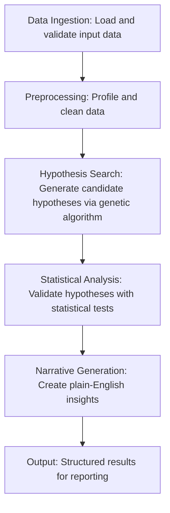

# Greta Core Engine Architecture

## Overview

The Greta Core Engine is the central Python library for Project Greta, encapsulating all analytical logic for automated data analysis. Designed for Phase 1 MVP, it leverages genetic algorithms to search for meaningful hypotheses in datasets, providing statistical validation and plain-English narratives. The engine serves as the backbone for both the CLI tool and future web interfaces, ensuring consistent analytical capabilities across platforms.

## Overall Structure

The Greta Core Engine is organized as a modular Python package with a layered architecture:

- **API Layer**: Public interfaces for external integration, providing high-level methods for data processing and analysis.
- **Core Modules**: Specialized components handling specific analytical tasks, including data ingestion, preprocessing, hypothesis search, statistical analysis, and narrative generation.
- **Utilities**: Shared helper functions for data manipulation, statistical computations, and algorithm support.
- **Configuration**: Parameter management for algorithm tuning and analysis settings.

This structure promotes separation of concerns, allowing independent development and testing of each module while maintaining a cohesive analytical pipeline.

## Key Modules

### Data Ingestion Module
Handles loading data from various sources including CSV files, Excel spreadsheets, and database connections. Provides unified data structures (e.g., Pandas DataFrames) for downstream processing, with support for schema detection and basic validation.

### Automated Preprocessing Module
Performs data profiling and cleaning operations automatically. Includes functions for handling missing values, outlier detection, data type normalization, and feature engineering. Ensures data quality and prepares datasets for hypothesis generation and statistical testing.

### Hypothesis Search Module
Implements the genetic algorithm for exploring potential relationships and patterns in data. Generates candidate hypotheses through evolutionary optimization, focusing on combinations of variables that may explain target outcomes.

### Statistical Analysis Module
Conducts rigorous statistical testing on generated hypotheses. Supports basic tests such as t-tests and ANOVA for Phase 1, with extensible design for future additions like regression analysis.

### Narrative Generation Module
Translates statistical results into plain-English insights and explanations. Creates human-readable summaries of findings, including confidence levels and practical implications.

## Data Flow

The core data flow through the Greta Core Engine follows a sequential pipeline:

Data enters through ingestion, undergoes quality improvements in preprocessing, is analyzed for patterns in hypothesis search, receives statistical validation, and finally gets interpreted into narratives for user consumption.

## Technology Choices

- **Pandas**: Primary data manipulation library for handling structured data, providing efficient DataFrame operations and integration with other scientific libraries.
- **SciPy**: Statistical computing library for hypothesis testing, probability distributions, and mathematical functions supporting the analysis module.
- **DEAP (Distributed Evolutionary Algorithms in Python)**: Framework for implementing genetic algorithms, offering flexible evolutionary computation tools for hypothesis search.
- **NumPy**: Fundamental package for array computing, serving as a dependency for Pandas and SciPy operations.
- **Python 3.8+**: Base language for type safety, extensive scientific ecosystem, and alignment with modern development practices.

These choices prioritize performance, reliability, and community support in the data science domain.

## Genetic Algorithm Details

### Chromosome Representation
Chromosomes are represented as variable-length binary strings, where each bit corresponds to the inclusion or exclusion of a dataset feature in a hypothesis. For example, a chromosome of length n (where n is the number of features) uses 1 to indicate feature selection and 0 to indicate exclusion. This representation allows efficient encoding of feature combinations for evolutionary search.

### Fitness Function
The fitness function is multi-objective, balancing multiple criteria to evaluate hypothesis quality:

- **Statistical Significance**: Measures the probability that observed relationships are not due to chance, typically using p-values from statistical tests.
- **Effect Size**: Quantifies the magnitude of relationships, ensuring practically meaningful findings rather than statistically significant but trivial effects.
- **Coverage**: Assesses the proportion of data explained by the hypothesis, promoting models that account for broader patterns.
- **Parsimony**: Penalizes overly complex hypotheses, favoring simpler models with fewer features to avoid overfitting.

The overall fitness combines these components through weighted aggregation, allowing evolutionary pressure to optimize across dimensions while preventing dominance by any single metric.

## Design Principles

### Modularity
Each analytical component operates as an independent module with well-defined inputs and outputs. This allows isolated development, testing, and maintenance, enabling parallel work on different engine aspects without cascading changes.

### Extensibility
The architecture employs abstract interfaces and plugin patterns, permitting addition of new data sources, statistical tests, and narrative styles without core modifications. Configuration-driven parameters support customization of algorithms and thresholds for different use cases.

These principles ensure the Greta Core Engine remains adaptable to evolving analytical needs while maintaining stability for Phase 1 MVP deployment.