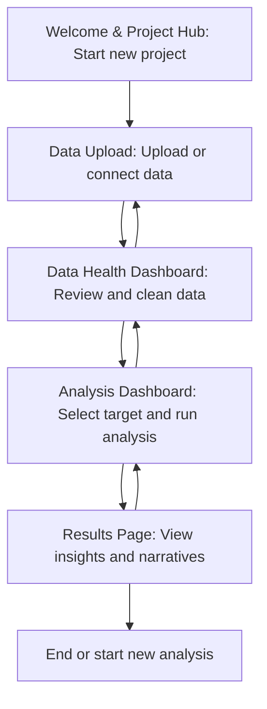

# Greta Web App Architecture

## Overview

The Greta Web App is the user-facing component of Project Greta, designed for Phase 2 to provide a guided, visual journey for non-expert users to perform automated data analysis using genetic algorithms. It wraps the Greta Core Engine in a multi-page Streamlit application, offering drag-and-drop data upload, interactive data health dashboards, analysis configuration, and results visualization. The app emphasizes accessibility, responsiveness, and seamless integration with greta_core to deliver plain-English insights without requiring technical expertise.

## Overall Structure

The Greta Web App is structured as a modular Streamlit application with the following components:

- **Main Application**: `app.py` serves as the entry point, utilizing Streamlit's multipage navigation to manage page routing.
- **Pages Directory**: Contains individual page modules (e.g., `welcome.py`, `upload.py`, `data_health.py`, `analysis.py`, `results.py`), each handling specific user interactions.
- **Utilities**: Shared helper functions for data processing, visualization, and state management.
- **Integration Layer**: Direct imports and calls to greta_core modules for analytical processing.

This structure ensures separation of concerns, with each page focused on a single aspect of the user journey, while the core engine handles the computational logic.

## Key Pages

### Welcome & Project Hub
The landing page introduces Greta, explains its purpose, and allows users to start a new project or load an existing one. It includes onboarding tips and a project overview dashboard for managing multiple analyses.

### Data Upload Interface
Provides a drag-and-drop interface for uploading data files (CSV, Excel, Parquet) or connecting to databases. Includes file validation, preview of data structure, and initial ingestion via greta_core.ingestion.

### Data Health Dashboard
Displays a comprehensive visual summary of data quality, including missing values, data types, outliers, and distribution plots. Offers interactive cleaning suggestions and advanced preprocessing options powered by greta_core.preprocessing, including automated feature engineering previews, encoding method selection, and real-time updates to data health metrics with enhanced feature engineering capabilities.

### Analysis Dashboard
Allows users to select a target variable, configure comprehensive analysis parameters (including genetic algorithm settings, statistical test preferences, feature engineering options, and encoding methods), and initiate the enhanced "Find Insights" process. Integrates with greta_core.hypothesis_search, greta_core.statistical_analysis (including non-parametric tests), and advanced preprocessing for comprehensive background processing with real-time progress updates.

### Results Page
Presents ranked findings from the comprehensive analysis, with expandable details on each hypothesis including causal analysis insights. Includes enhanced narrative summaries from greta_core.narrative_generation with references to preprocessing and feature engineering, detailed statistical metrics (including non-parametric test results), and interactive visualizations of results with PDF export capabilities.

## User Flow

The user flow is designed as a guided, linear journey for non-experts, with optional navigation back to previous steps:

Users progress step-by-step, with visual cues and tooltips to guide decisions. The flow emphasizes transparency, showing progress and allowing iterative refinement.

## Data Flow and State Management

Data flows through the app in alignment with the enhanced greta_core pipeline:

1. **Ingestion**: User-uploaded data is loaded via greta_core.ingestion and stored in st.session_state['raw_data'].
2. **Enhanced Preprocessing**: Data health actions and feature engineering update st.session_state['cleaned_data'] using greta_core.preprocessing with automated feature generation and advanced encoding.
3. **Comprehensive Analysis**: Hypothesis search with genetic algorithms, statistical analysis (including non-parametric tests), and causal analysis populate st.session_state['results'] with enhanced findings and narratives.
4. **Persistence**: st.session_state maintains data across pages, enabling seamless navigation without reprocessing.

State management uses Streamlit's session state for user data, progress flags, and results, ensuring data persists during the session while allowing resets for new projects.

## Technology Choices

- **Streamlit**: Primary framework for building the multi-page web application, chosen for its simplicity, rapid prototyping, and built-in state management suitable for data apps.
- **Plotly**: Library for interactive visualizations, providing responsive charts and graphs for data exploration and results display.
- **Greta Core Engine**: Integrated as a dependency for all analytical computations, leveraging Pandas, SciPy, and DEAP for processing.
- **Python 3.8+**: Consistent with the core engine, ensuring compatibility and access to modern libraries.

## Interactive Visualizations

Interactive visualizations are central to the guided journey, using Plotly to enable user exploration:

- **Data Health**: Histograms, box plots, and heatmaps for missing data, with hover details and filtering options.
- **Analysis Configuration**: Dynamic previews of selected variables and parameters.
- **Results**: Scatter plots, bar charts, and expandable hypothesis visualizations, allowing users to drill down into insights.

Visualizations update in real-time based on user actions, promoting engagement and understanding.

## Loading Animations

To enhance user experience during processing:

- **Progress Bars**: Display during data ingestion, preprocessing, and analysis using st.progress.
- **Spinners**: Indicate background tasks with st.spinner, accompanied by descriptive messages (e.g., "Searching for insights...").
- **Status Updates**: Real-time feedback on genetic algorithm iterations or statistical computations.

Animations prevent user confusion during potentially long operations, maintaining a responsive feel.

## Design Principles

### Accessibility
- High contrast colors and readable fonts for users with visual impairments.
- Keyboard navigation support for all interactive elements.
- Alt text and ARIA labels for visualizations and buttons.
- Plain-language explanations to accommodate varying literacy levels.

### Responsiveness
- Mobile-first design with adaptive layouts using Streamlit's responsive components.
- Scalable visualizations that adjust to screen size.
- Touch-friendly interfaces for tablet and mobile users.

### Integration with Greta Core
- Direct module imports for tight coupling with greta_core, ensuring consistent analytical logic.
- Asynchronous processing via Streamlit's caching and rerun mechanisms to handle computational load.
- Error handling that maps core engine exceptions to user-friendly messages, maintaining abstraction.

These principles ensure the web app is inclusive, adaptable, and reliable, delivering the core engine's capabilities in an intuitive interface.