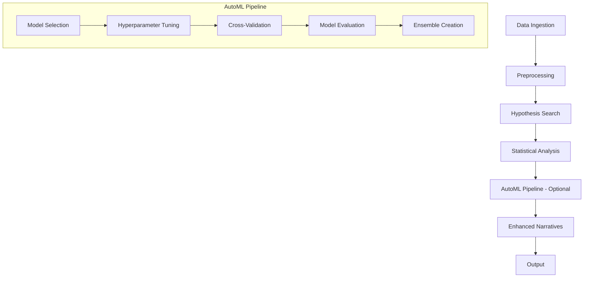

# Feature 3: Expanded Analytical Capabilities (AutoML) - Technical Specification

## Overview

This specification outlines the architecture for implementing AutoML capabilities in GRETA, extending the existing analytical framework with automated machine learning, advanced time series forecasting, unsupervised learning, and Bayesian inference. The design ensures seamless integration with current workflows while providing optional, configurable AutoML features.

## Architecture Overview

### Modular AutoML Framework

The AutoML framework will be implemented as a new `greta_core.automl` module, following GRETA's modular architecture pattern. The framework consists of:

- **Model Registry**: Centralized registry for ML models with metadata and capabilities
- **AutoML Pipeline**: Orchestrates model selection, training, tuning, and evaluation
- **Evaluation Pipeline**: Standardized cross-validation and performance assessment
- **Integration Layer**: Seamless connection with existing statistical analysis and hypothesis search

### Data Flow Integration



## New Modules

### 1. Machine Learning Models (`greta_core/automl/models/`)

#### Base Classes
- `BaseModel`: Abstract base class for all ML models
- `SupervisedModel`: Base for classification/regression models
- `UnsupervisedModel`: Base for clustering/dimensionality reduction

#### Specific Implementations
- **Supervised Learning**:
  - `RandomForestModel`
  - `XGBoostModel`
  - `LightGBMModel`
  - `NeuralNetworkModel` (TensorFlow/Keras)
  - `SVMModel`
  - `LogisticRegressionModel`

- **Time Series Forecasting**:
  - `ARIMAModel`
  - `ProphetModel`
  - `LSTMModel`
  - `GRUModel`

- **Unsupervised Learning**:
  - `KMeansModel`
  - `DBSCANModel`
  - `GaussianMixtureModel`
  - `PCA_Model`

- **Bayesian Models**:
  - `BayesianLinearRegression`
  - `BayesianLogisticRegression`
  - `BayesianHypothesisTesting`

### 2. Model Registry (`greta_core/automl/registry.py`)

```python
class ModelRegistry:
    def register_model(self, model_class, metadata):
        """Register a model with capabilities and requirements"""

    def get_models_by_task(self, task_type):
        """Retrieve models suitable for specific ML tasks"""

    def get_model_info(self, model_name):
        """Get detailed model metadata"""
```

### 3. AutoML Pipeline (`greta_core/automl/pipeline.py`)

```python
class AutoMLPipeline:
    def __init__(self, config, data):
        self.config = config
        self.data = data

    def run_automl(self):
        """Execute complete AutoML workflow"""
        models = self.select_models()
        tuned_models = self.tune_hyperparameters(models)
        evaluated_models = self.evaluate_models(tuned_models)
        ensemble = self.create_ensemble(evaluated_models)
        return ensemble
```

### 4. Evaluation Framework (`greta_core/automl/evaluation.py`)

- Cross-validation strategies (k-fold, stratified, time-series split)
- Performance metrics (accuracy, precision, recall, F1, AUC, RMSE, MAE, etc.)
- Model comparison and ranking
- Statistical significance testing for model differences

### 5. Hyperparameter Tuning (`greta_core/automl/tuning.py`)

- Grid search
- Random search
- Bayesian optimization (using scikit-optimize)
- Integration with existing GA framework for hyperparameter optimization

## Integration with Existing Modules

### Statistical Analysis Integration

The AutoML results will be integrated with `greta_core.statistical_analysis` by:

- Using existing hypothesis evaluation for feature importance
- Extending statistical tests to compare ML model performance
- Incorporating causal analysis for feature selection in ML models

### Hypothesis Search Integration

- AutoML can use hypothesis search results as feature selection input
- ML models can be evaluated on hypotheses-generated feature sets
- Ensemble methods combining GA-selected features with ML predictions

### Configuration Integration

Add new section to `GretaConfig`:

```yaml
automl:
  enabled: true
  task_type: "classification"  # classification, regression, forecasting, clustering
  models:
    - random_forest
    - xgboost
    - neural_network
  tuning:
    method: "bayesian"
    max_evals: 50
  evaluation:
    cv_folds: 5
    metrics: ["accuracy", "f1", "auc"]
  time_series:
    enabled: true
    forecast_horizon: 30
  clustering:
    enabled: false
    n_clusters: "auto"
  bayesian:
    enabled: true
    uncertainty_quantification: true
```

## Dependencies

### New Dependencies to Add

```toml
# Machine Learning
tensorflow>=2.10.0
xgboost>=1.7.0
lightgbm>=3.3.0
scikit-optimize>=0.9.0

# Time Series
prophet>=1.1.0
statsmodels>=0.13.0

# Bayesian Inference
pymc3>=3.11.0
arviz>=0.12.0

# Additional ML utilities
optuna>=3.0.0  # Alternative hyperparameter tuning
mlflow>=2.0.0  # Model tracking (optional)
```

### Existing Dependencies Utilized

- scikit-learn (already present)
- numpy, pandas, scipy (already present)
- matplotlib, plotly (for visualizations)

## Evaluation Metrics and Model Selection

### Supervised Learning Metrics
- **Classification**: Accuracy, Precision, Recall, F1-Score, AUC-ROC, AUC-PR
- **Regression**: RMSE, MAE, R², MAPE, SMAPE

### Time Series Metrics
- MAE, RMSE, MAPE, SMAPE
- Forecast accuracy over different horizons
- Residual analysis and stationarity tests

### Clustering Metrics
- Silhouette Score, Calinski-Harabasz Index, Davies-Bouldin Index
- Stability across different random seeds

### Bayesian Metrics
- Posterior predictive checks
- WAIC, LOO-CV for model comparison
- Uncertainty quantification (credible intervals)

### Model Selection Criteria
1. Primary metric performance
2. Computational efficiency
3. Model interpretability
4. Statistical significance of performance differences
5. Cross-validation stability

## Output Formats

### Model Artifacts
- Serialized model files (joblib/pickle for sklearn, SavedModel for TF)
- Model metadata (training parameters, performance metrics, feature importance)
- Hyperparameter optimization history

### Performance Reports
```json
{
  "automl_results": {
    "best_model": {
      "name": "xgboost",
      "performance": {
        "accuracy": 0.92,
        "f1": 0.91,
        "auc": 0.94
      },
      "hyperparameters": {...},
      "feature_importance": {...}
    },
    "model_comparison": [...],
    "cross_validation_results": {...},
    "training_time": 120.5
  }
}
```

### Enhanced Narratives Integration
- AutoML results incorporated into existing narrative generation
- Plain-English explanations of model performance and feature importance
- Recommendations for model deployment and monitoring

## CLI Integration

### New Commands

```bash
# Run AutoML analysis
greta-cli automl --config config.yml --output results.json

# Run with specific AutoML options
greta-cli run --config config.yml --automl-enabled --task-type classification

# Generate AutoML-specific reports
greta-cli report --input-file results.json --automl-report --format pdf
```

### Enhanced Existing Commands

The `run` command will be extended with AutoML options:

```bash
greta-cli run --config config.yml \
  --enable-automl \
  --automl-models random_forest,xgboost \
  --automl-tuning-method bayesian \
  --output enhanced_results.json
```

### Configuration via CLI

```bash
# Override AutoML config
greta-cli run --config config.yml \
  --override '{
    "automl": {
      "enabled": true,
      "task_type": "regression",
      "tuning": {"max_evals": 100}
    }
  }'
```

## Workflow Preservation

### Backward Compatibility
- AutoML features are optional and disabled by default
- Existing workflows continue unchanged
- Configuration files remain valid without AutoML sections

### Progressive Enhancement
- AutoML can be enabled per analysis run
- Results include both traditional statistical analysis and ML insights
- Users can choose between statistical modeling and ML approaches

### Performance Considerations
- AutoML execution is parallelized where possible
- Memory-efficient implementations for large datasets
- Optional model persistence to avoid retraining

## Implementation Phases

1. **Phase 1**: Core AutoML framework and supervised learning models
2. **Phase 2**: Time series forecasting and hyperparameter tuning
3. **Phase 3**: Unsupervised learning and clustering
4. **Phase 4**: Bayesian inference and advanced evaluation
5. **Phase 5**: Integration with web interface and advanced reporting

## Testing Strategy

- Unit tests for individual models and pipeline components
- Integration tests with existing GRETA workflows
- Performance benchmarks against baseline statistical methods
- Validation on real-world datasets from existing test suite

## Security and Compliance

- Model serialization security (avoid pickle where possible)
- Data privacy considerations for model training
- Audit logging for AutoML decisions
- Compliance with ML best practices (no data leakage in CV)